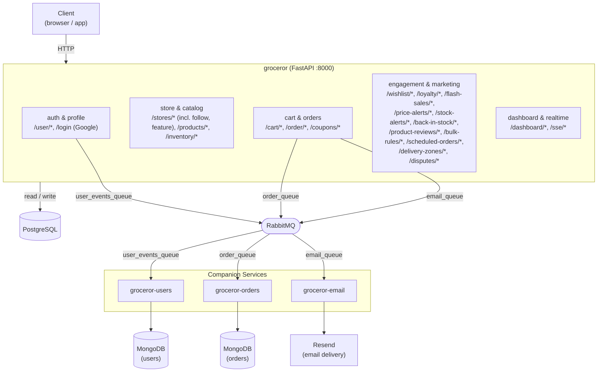

# Architecture

`main.py` registers ~23 routers total (`api/*_api.py`); the diagram groups them by concern rather than listing each one. `api/firebase_api.py` exists but is commented out in `main.py` (not currently mounted).
