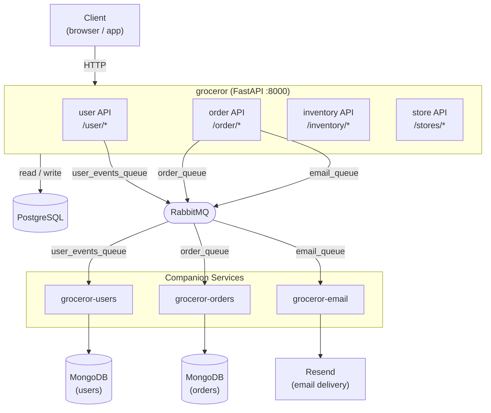

# Architecture

```mermaid
graph TD
    Client["Client\n(browser / app)"]

    subgraph groceror ["groceror (FastAPI :8000)"]
        UserAPI["user API\n/user/*"]
        OrderAPI["order API\n/order/*"]
        InventoryAPI["inventory API\n/inventory/*"]
        StoreAPI["store API\n/stores/*"]
    end

    PG[("PostgreSQL")]
    RMQ(["RabbitMQ"])

    subgraph consumers ["Companion Services"]
        GU["groceror-users"]
        GO["groceror-orders"]
        GE["groceror-email"]
    end

    UsersMongo[("MongoDB\n(users)")]
    OrdersMongo[("MongoDB\n(orders)")]
    Resend["Resend\n(email delivery)"]

    Client -->|HTTP| groceror
    groceror -->|read / write| PG
    UserAPI -->|user_events_queue| RMQ
    OrderAPI -->|order_queue| RMQ
    OrderAPI -->|email_queue| RMQ
    RMQ -->|user_events_queue| GU
    RMQ -->|order_queue| GO
    RMQ -->|email_queue| GE
    GU --> UsersMongo
    GO --> OrdersMongo
    GE --> Resend
```
