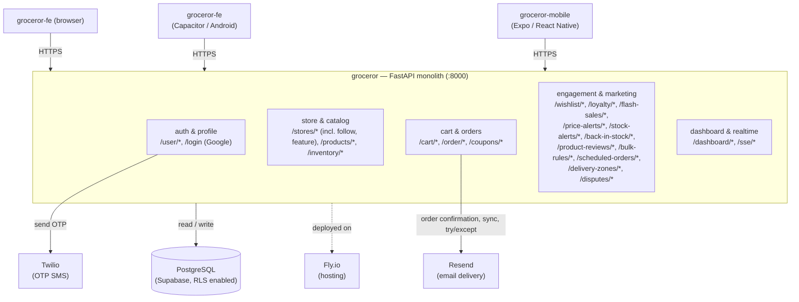

# Architecture

> groceror was originally split into companion microservices (`groceror-users`, `groceror-orders`, `groceror-email`) talking over RabbitMQ, each mirroring data into its own MongoDB. That's been retired — everything below reflects the current monolith. If you find an old diagram elsewhere in the repo's history showing RabbitMQ/MongoDB, it's stale.

```mermaid
graph TD
    Web["groceror-fe (browser)"]
    Android["groceror-fe\n(Capacitor / Android)"]
    MobileApp["groceror-mobile\n(Expo / React Native)"]

    subgraph groceror ["groceror — FastAPI monolith (:8000)"]
        UserAPI["auth & profile\n/user/*, /login (Google)"]
        StoreAPI["store & catalog\n/stores/* (incl. follow, feature), /products/*, /inventory/*"]
        CartOrderAPI["cart & orders\n/cart/*, /order/*, /coupons/*"]
        EngagementAPI["engagement & marketing\n/wishlist/*, /loyalty/*, /flash-sales/*,\n/price-alerts/*, /stock-alerts/*, /back-in-stock/*,\n/product-reviews/*, /bulk-rules/*, /scheduled-orders/*,\n/delivery-zones/*, /disputes/*"]
        DashboardAPI["dashboard & realtime\n/dashboard/*, /sse/*"]
    end

    PG[("PostgreSQL\n(Supabase, RLS enabled)")]
    Resend["Resend\n(email delivery)"]
    Twilio["Twilio\n(OTP SMS)"]
    Fly["Fly.io\n(hosting)"]

    Web -->|HTTPS| groceror
    Android -->|HTTPS| groceror
    MobileApp -->|HTTPS| groceror
    groceror -->|read / write| PG
    UserAPI -->|send OTP| Twilio
    CartOrderAPI -->|order confirmation, sync, try/except| Resend
    groceror -.->|deployed on| Fly
```

`main.py` registers 23 routers (`api/*_api.py`); the diagram groups them by concern rather than listing each one. `api/firebase_api.py`/`api/google_login.py` exist but are legacy/unused — see [CLAUDE.md](CLAUDE.md) before touching them.

## Deployment

- **Backend** (this repo): [Fly.io](https://fly.io), auto-deployed on push to `master` via GitHub Actions (`.github/workflows/python-app.yml`) — tests run first, deploy only happens if they pass. Live at [groceror.fly.dev](https://groceror.fly.dev).
- **Database**: PostgreSQL hosted on Supabase, with Row Level Security enabled on all public tables.
- **Frontend** ([groceror-fe](https://github.com/lordlabakdas/groceror-fe)): a React SPA, auto-deployed to Netlify on push to `main`. Live at [groceror.store](https://groceror.store). Talks to this API directly over `VITE_API_URL` — there is no server-side rendering or proxy layer in production.
- **Mobile**: `groceror-fe` is also wrapped as a native Android app via [Capacitor](https://capacitorjs.com) (see `capacitor.config.ts` / `android/` in that repo) — same React codebase, same API, packaged as a WebView app rather than rebuilt natively. [groceror-mobile](https://github.com/lordlabakdas/groceror-mobile) is a separate, from-scratch Expo/React Native client hitting the same API.

## Data model at a glance

Two entity roles share one auth table: `PhoneVerification` (phone, password hash, `entity_type` = `"user"` or `"store"`) is the login identity; `User` and `Store` each hold a `entity_id` foreign key back to it and carry the role-specific profile fields. Everything else — `Inventory`, `Order`/`OrderItem`, `Coupon`, `LoyaltyAccount`/`LoyaltyTransaction`, `Cart`/`CartItem`, and the various engagement tables (wishlist, reviews, alerts, flash sales, disputes) — hangs off a `Store` and/or `User`.

## Feature specs

Larger features get a design doc before implementation — see [SPEC_ORDER_ANALYTICS.md](SPEC_ORDER_ANALYTICS.md) and [SPEC_REWARDS_PROGRAM.md](SPEC_REWARDS_PROGRAM.md).
